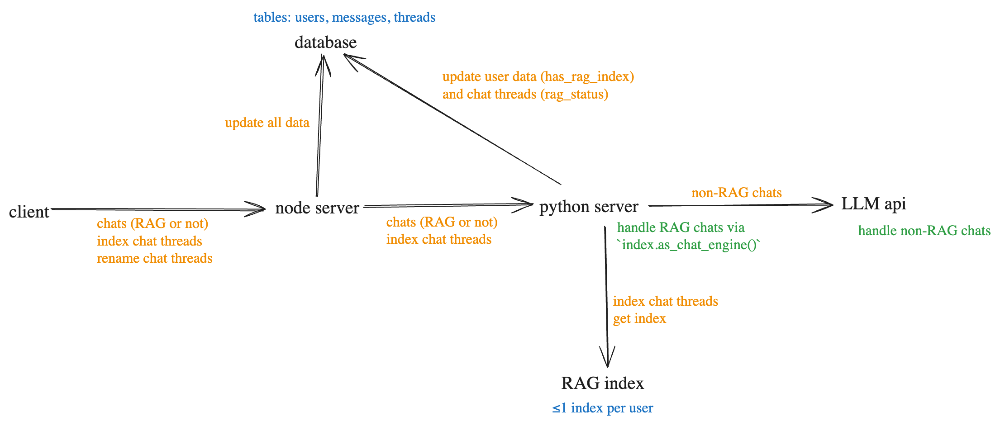

# overview

this is a silly little chatbot that uses RAG to reference previous chat threads, so that you can "chat with your chats"! it's built using react + vite with a sqlite database, using a python server running llama index for RAG.

schematically, it's organized as follows.



it could be organized more cleanly with a single server, but i started out with just node and then added python for llama index.

# installation

## node

note that there are `package.json` files in `/`, `frontend/`, and `backend/`. run `npm ci` in all three of these folders to download the appropriate node modules.

## python

create a virtual environment: in `backend/`, do `python -m venv python_venv`. therein, this can be activated using `source python_venv/bin/activate` and deactivated using `deactivate`. after activating, install the dependencies using `pip install -r requirements.txt`.

## database

inside of `backend/database/`, run `node init.js` to initialize the sqlite database. use `one-time-operations.js` therein for one-off database operations.

# API keys

this uses a `.env` file in the root, with _no_ sensitive content (so it's present in the repo). it also uses a `backend/.env` file, which should look like:

```
# SENSITIVE
VITE_ANTHROPIC_API_KEY=[enter yours here, if needed]
OPENAI_API_KEY=[enter yours here, if needed]

# NOT SENSITIVE
PORT=3000
PYTHON_SERVER_PORT=8000
SYSTEM_PROMPT="Your name is Ragnar the RAGbot. You love to use RAG (retrieval-augmented generation) to refer to past chats!"
```

# to run

simultaneously run the frontend and node server by running `npm run dev` in `/`. start the python server by running `python llama_server.py` in `backend/`.

the react+vite app is served on port 5173 (vite's default).

the node server listens on port 3000.

the python fastAPI server listens on port 8000.

# to-do

## MVP goals

- [x] turn ChatHistory into Sidebar, with header and a chathistory components.
- [x] save chats (and user ids) to a database
- [x] display chat history.
- [x] in a new chat, once the current chat is created, highlight it. but also, highlight other older chats when we jump back to those.
- [x] add a "new chat" button to the header.
- [x] allow user to change the title of the thread using the `updateThread` function.
- [x] reroute chat functionality through llama server.
- [x] allow rag and re-rag of threads.
  - [x] do this on the server side.
  - [x] enable the user to do this, i.e.:
    - [x] track which threads are unragged or have been updated since last getting ragged.
    - [x] update the index.
    - [x] toggle "RAG chat" on and off.
    - [x] chat with chats!
- [ ] host on a server!

## stretch goals

- [ ] enable streaming responses.
- [ ] add functionality for multiple users. (for starters, just enter a username when you arrive.)
- [x] add an organizational schematic to the readme.
- [ ] bound the length of a new thread title. (maybe allow a longer description, separately?)
- [ ] keep track of the input in other previous threads, so that when the user returns to it it's still there.
- [ ] bound the number of users (as a gross security measure).
- [ ] add oauth login, perhaps with a cookie to persist between sessions.
- [ ] allow uploading docs and adding them to the index.
- [ ] add a scheduler to delete data if it's associated to a past chat -- or a sufficiently old chat, or if there's too much data.
- [ ] add a button in sidebar to close it. and when it's closed, keep a button in the top-left to open it. this should override the disappearance coming from shrinking the window to be too narrow.
